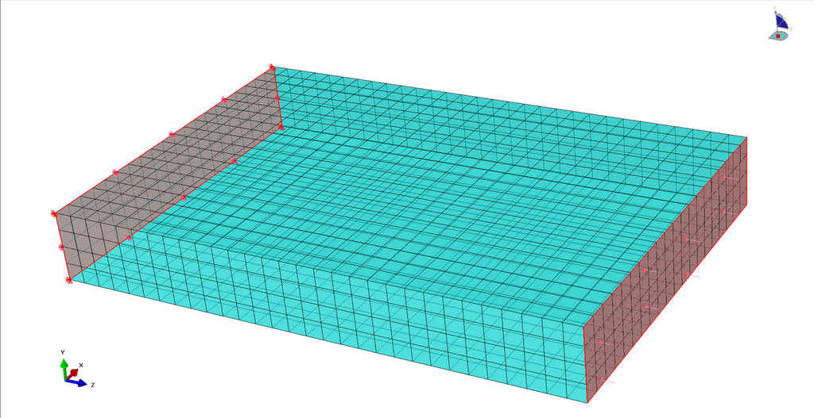
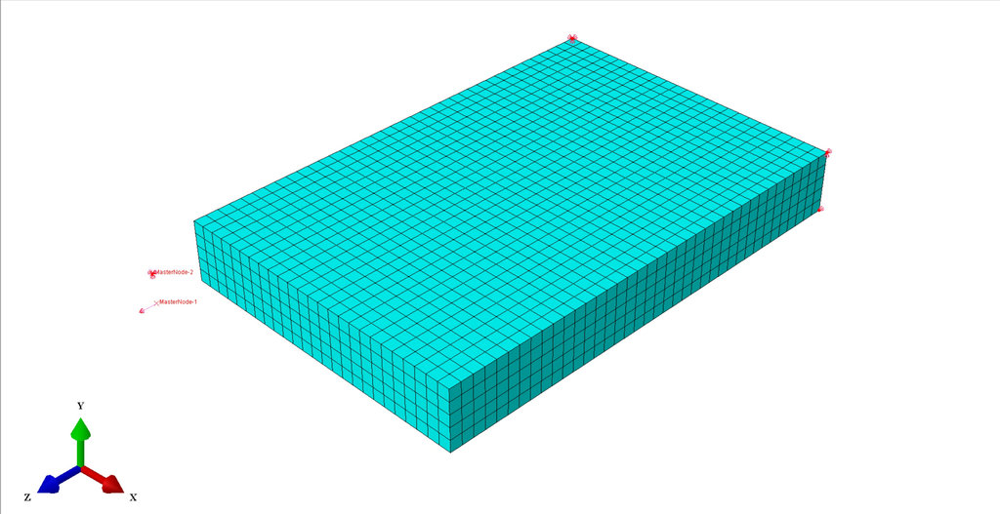
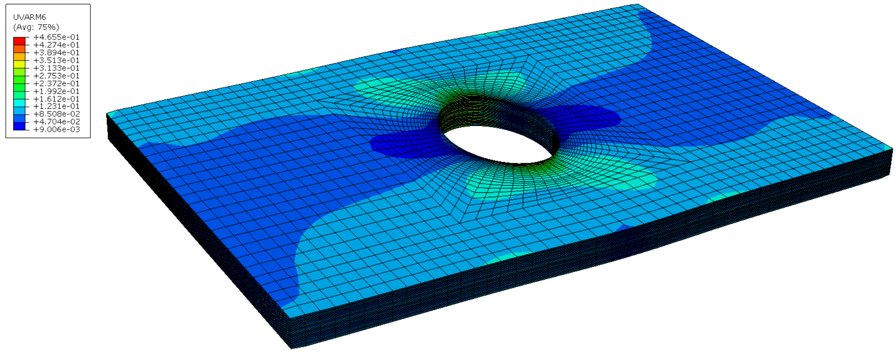
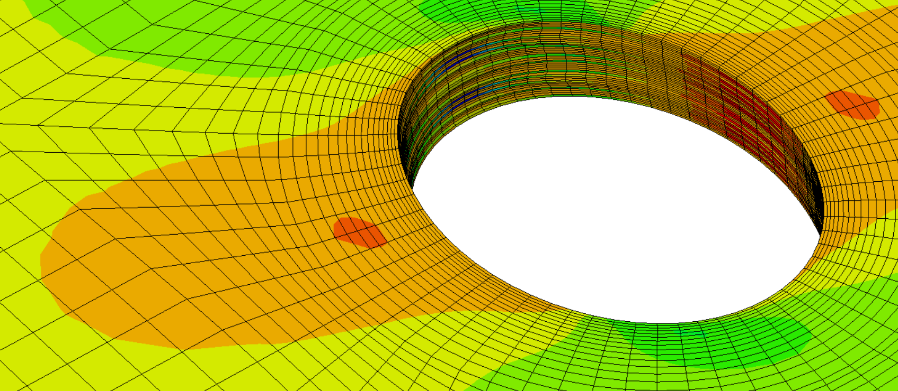

.. _examples:

Examples
=================================

This chapter contains examples of building Abaqus models using the 
:py:class:`Part <AbaqusTools.part.Part>` and 
:py:class:`Model <AbaqusTools.model.Model>` classes.

.. note:: 

    When running the example python scripts, 
    put the scripts in the same directory as the 'AbaqusTools' folder.
    Run the following command in the Command Prompt (CMD) of Windows or the terminal of Linux.
    It is suggested to clean up the `*.pyc` files before calling Abaqus, because the `*.pyc` files
    are the compiled Python files that store the bytecode of the source code. 
    They are most likely compiled by Abaqus in previous jobs.
    Abaqus will not update them once they existed, even if the source code is modified.
    The `clean.bat` gives an example of cleaning Abaqus jobs in Windows.

.. code-block:: bash
    :linenos:

    abaqus cae script=script.py

    clean.bat & abaqus cae script=script.py

Summary
-------

These examples demonstrate the progression from basic modeling to advanced composite analysis:

1. **Example 1**: Basic steel beam compression - foundation concepts
2. **Example 2**: PBC implementation for material characterization - advanced boundary conditions  
3. **Example 3**: Composite laminate analysis - material modeling extensions
4. **Example 4**: Complex geometry and failure analysis - comprehensive engineering simulation

Example 1: Steel Beam Compression
----------------------------------

**Problem Setup:**

This example demonstrates a basic compression test of a steel beam using the AbaqusTools library. 
The problem involves:

- **Geometry**: A rectangular steel beam (100×20×150 mm)
- **Material**: Isotropic steel with standard properties
- **Loading**: Uniform pressure applied to the top surface (z=150 mm)
- **Boundary Conditions**: Fixed displacement at the bottom surface (z=0 mm)
- **Element Type**: 3D stress elements (C3D8R)
- **Mesh**: Structured mesh with 5 mm element size

The example tests the basic functionality of the :py:class:`Part <AbaqusTools.part.Part>` and 
:py:class:`Model <AbaqusTools.model.Model>` classes, including geometry creation, meshing, 
material assignment, and load application.

**Files:**

- `steel-beam-compression.py`: Main script defining the SteelBeam part and TestModel
- `mesh-loads.jpg`: Visualization of the meshed beam with applied loads and boundary conditions

    
    Steel beam model showing mesh, applied pressure load, and fixed boundary condition

**Usage:**

.. code-block:: bash

    abaqus cae script=steel-beam-compression.py

Example 2: Steel Beam PBC Stiffness
------------------------------------

**Problem Setup:**

This example demonstrates the implementation of Periodic Boundary Conditions (PBC) for calculating 
the effective stiffness matrix of a steel beam. The problem features:

- **Geometry**: Steel beam (100×20×50 mm)
- **Material**: Isotropic steel
- **Boundary Conditions**: Periodic boundary conditions using constraint equations
- **Master Nodes**: Reference points to control periodic deformation
- **Analysis**: Four load cases with unit strain vectors to build the 4×4 stiffness matrix
- **Element Type**: 3D stress elements (C3D8R)

The periodic boundary conditions are implemented using constraint equations that link displacement 
degrees of freedom on opposite faces. Master nodes (reference points) are used to apply controlled 
strains and measure reaction forces.

**Files:**

- `beam-strain-vector-C3D8R.py`: Main script with PBC implementation
- `run-strain-vectors.py`: Batch script to run all four strain vector cases
- `theoretical-stiffness.py`: Script to calculate theoretical stiffness values
- `stiffness-matrix.dat`: Output file containing computed stiffness matrix
- `mesh-loads-4750.jpg`: Visualization of the meshed beam

    
    Steel beam model with 4750 nodes showing periodic boundary conditions setup

**The stiffness matrix calculation involves:**

1. Applying unit strain in each direction (εxx, εyy, εzz, γxy)
2. Measuring reaction forces at master nodes
3. Computing stiffness coefficients from force-strain relationships
4. Comparing with theoretical values for validation

**Usage:**

.. code-block:: bash

    # Run individual strain vector case
    abaqus cae script=beam-strain-vector-C3D8R.py
    
    # Run all four cases to build complete stiffness matrix
    python run-strain-vectors.py

Example 3: Laminate PBC Stiffness  
----------------------------------

**Problem Setup:**

This example extends the PBC approach to composite laminate analysis. It calculates the effective 
stiffness matrix of a composite beam with periodic boundary conditions:

- **Geometry**: Composite beam (100×20×150 mm)
- **Material**: IM7/8552 carbon fiber composite
- **Layup**: [45°, -45°, 0°, 90°, 0°] with symmetric stacking
- **Element Type**: Continuum shell elements (SC8R)
- **Composite Properties**: Ply-by-ply modeling with specified fiber orientations
- **Analysis**: Four strain vector cases similar to Example 2

The example demonstrates the use of composite layup functionality in AbaqusTools, including:
- Fiber orientation definition
- Symmetric layup creation
- Through-thickness element discretization
- Continuum shell element formulation

**Files:**

- `laminate-strain-vector-SC8R.py`: Main script with composite PBC implementation
- `run-strain-vectors.py`: Batch script for all strain cases
- `stiffness-matrix.dat`: Computed composite stiffness matrix

**Usage:**

.. code-block:: bash

    # Run individual case
    abaqus cae script=laminate-strain-vector-SC8R.py
    
    # Run complete stiffness matrix calculation
    python run-strain-vectors.py

Example 4: Open Hole Compression
---------------------------------

**Problem Setup:**

This example simulates an open hole compression test of a composite plate, demonstrating advanced 
modeling capabilities including complex geometry creation, progressive damage analysis, and 
post-processing:

**Geometry and Loading:**

- **Plate Dimensions**: 60×100×4 mm (from input.txt)
- **Hole**: Circular hole with 10 mm radius at plate center
- **Material**: Composite laminate with user-defined layup
- **Loading**: Compression in y-direction with -0.1% strain
- **Boundary Conditions**: Fixed bottom edge, applied displacement at top

**Advanced Features:**

- **Complex Geometry**: Automatic hole creation and mesh partitioning around stress concentrations
- **User Subroutines**: UVARM subroutine for progressive damage analysis
- **Failure Analysis**: Implementation of composite failure criteria
- **Post-Processing**: Automated extraction of stress fields and failure indices

**Files:**

- `open-hole-compression.py`: Main script (973 lines) with comprehensive modeling
- `input.txt`: Geometry parameters and loading conditions
- `run-uvarm.py`: Batch script with user subroutine compilation
- `extract-hole-face-data.py`: Post-processing script for stress field extraction
- `FI-max-field.png`: Failure index contour plot
- `hole-face-stress-field.png`: Stress field visualization around the hole

    
    Maximum failure index field showing damage initiation around the hole

    
    Stress field distribution on the hole boundary surface

**The analysis workflow includes:**

1. **Preprocessing**: 
   - Reading geometry parameters from input file
   - Creating complex geometry with hole and partitions
   - Generating refined mesh around stress concentrations
   
2. **Analysis**:
   - Running Abaqus simulation with user subroutine
   - Progressive damage analysis using composite failure criteria
   
3. **Post-processing**:
   - Extracting stress and failure data from ODB file
   - Generating contour plots and field visualizations
   - Analyzing hole boundary stress distributions

**Usage:**

.. code-block:: bash

    # Run complete analysis with user subroutine
    python run-uvarm.py
    
    # Or run individual components
    abaqus cae script=open-hole-compression.py
    abaqus interactive job=Job_OHT cpus=4
    abaqus cae script=extract-hole-face-data.py

    # Or run with user subroutine
    abaqus job=Job_OHT user=uvarm.f90 cpus=4
