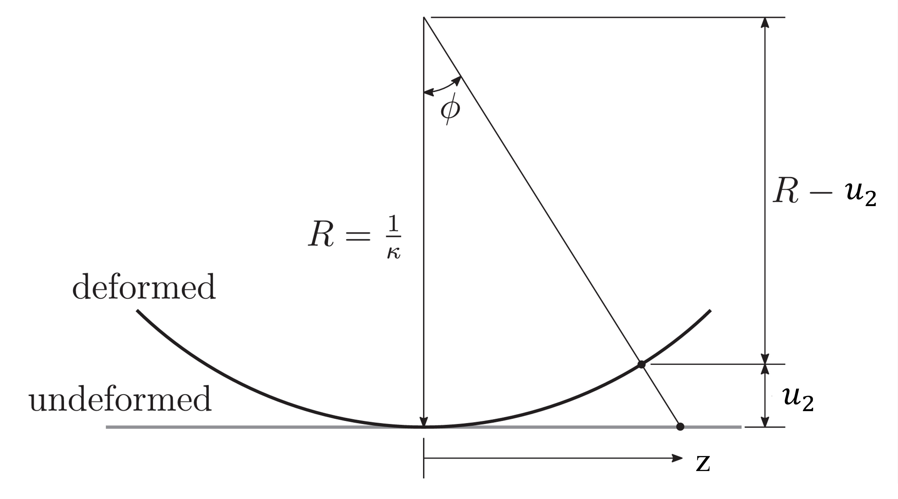
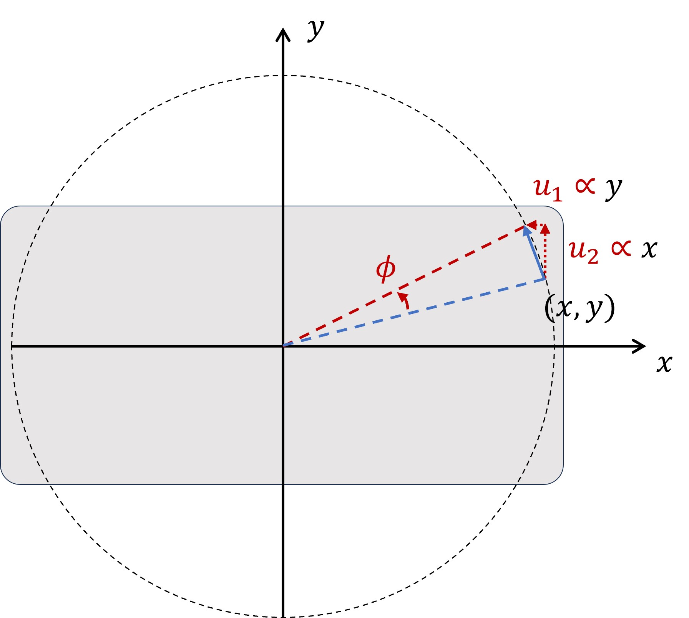

Periodic boundary condition
==================================

This section introduces the theory of periodic boundary conditions (PBC).
Their implementation in Abaqus python script is in the
:py:class:`PeriodicBC <AbaqusTools.pbc.PeriodicBC>` class.

The PBCs used in this project are implemented through the use of constraint equations.
Constraint equations are used to force the displacement of the nodes on one boundary 
onto the corresponding nodes on the opposite periodic boundary. 
This method does not enforce the edge nodes to retain their original alignment with adjacent nodes. 
The constraint equations, which are described by the displacement relationships derived by Suquet [5],
require that pairs of nodes are identified,
so that each node lies on a periodic boundary opposite each other occupying the same position along the respective boundary. 
This requirement implies that the number and position of nodes on opposing periodic boundaries are identical. 
Once the node pairs are identified, the periodic boundary conditions can be implemented.

.. seealso:: 

    [1] Julian Dizy, Rafael Palacios, Silvestre T. Pinho, Homogenisation of slender periodic composite structures,
    International Journal of Solids and Structures, 2013

    [2] R. Häsä, S.T. Pinho, Failure mechanisms of biological crossed-lamellar microstructures applied to 
    synthetic high-performance fibre-reinforced composites, Journal of the Mechanics and Physics of Solids, 2019

    [3] R. Häsä, S.T. Pinho, A three-level hybrid metal/in-plane-CFRP/crossed-lamellar microstructure concept 
    for containment applications, Composites Part A, 2019

    [4] Luke Mizzi, Daphne Attard, Ruben Gatt, et al,  Implementation of periodic boundary conditions for loading 
    of mechanical metamaterials and other complex geometric microstructures using finite element analysis,
    Engineering with Computers, 2021

    [5] Suquet PM, Homogenization techniques for composite media. Springer, Berlin, 1987

Tension
----------------------------------

Assume the model is loaded in displacement-controlled pure tension in the z-axis using PBCs.
The displacements in the z-direction on the left and right boundaries, 
:math:`u_i^L` and :math:`u_i^R` (:math:`i=1,2,3`), can be written as 

.. math::
    \begin{array}{ll}
        u_i^L(x,y) = \bar{u}_i^L + \tilde{u}_i(x,y)  \\
        u_i^L(x,y) = \bar{u}_i^R + \tilde{u}_i(x,y)
    \end{array}
    :label: pbc_tension_warping_field

where :math:`\bar{u}_i^L` and :math:`\bar{u}_i^R` are displacements due to eventual tension,
:math:`\tilde{u}_i(x,y)` is the warping field (fluctuation terms). 
The PBCs can be expressed by combining the equations as

.. math::
    u_i^R(x,y) - u_i^L(x,y) = \bar{u}_i^R - \bar{u}_i^L
    :label: pbc_tension_displacement

In an FE environment, this equation can be implemented using a master node `MN1`:

.. math::
    u_i^R(x,y) - u_i^L(x,y) = u_i^{MN1}
    :label: pbc_tension_constraint_eqn

Tension can be applied by giving :math:`u_3^{MN1}` a displacement corresponding to 
a desired displacement while the other two degrees of freedom are left free 
to ensure no other forces are applied. 

The :py:meth:`create_constraints_tension <AbaqusTools.pbc.PeriodicBC.create_constraints_tension>` function
in the :py:class:`PeriodicBC <AbaqusTools.pbc.PeriodicBC>` class is used to create the PBC constraint equations
for the tension loading cases.

Bending
----------------------------------

Assume the model is loaded in displacement-controlled pure bending about the model x-axis using PBCs.
According to :numref:`pbc_beam_pure_bending`, the displacement in the z-direction of a beam in pure bending 
depends on the distance from the neutral axis, :math:`y`, and the angle of distortion from neutral axis, 
:math:`\phi`.
Assuming a small angle :math:`\phi`, the displacements in the z-direction on the left and right boundaries, 
:math:`u_3^L` and :math:`u_3^R`, can be written as 

.. math::
    \begin{array}{ll}
        u_3^L(x,y) = \bar{u}_3^L + \phi \cdot y + \tilde{u}_3(x,y)  \\
        u_3^R(x,y) = \bar{u}_3^R - \phi \cdot y + \tilde{u}_3(x,y)
    \end{array}
    :label: pbc_bending_warping_field

where :math:`\bar{u}_3^L` and :math:`\bar{u}_3^R` are displacements due to eventual tension,
:math:`\phi` is the angle of rotation from the vertical plane, and
:math:`\tilde{u}_3(x,y)` is the warping field (fluctuation terms). 

.. _pbc_beam_pure_bending:

    Beam in pure bending [3]

The PBCs can be expressed by combining the equations as

.. math::
    u_3^R(x,y) - u_3^L(x,y) = \bar{u}_3^R - \bar{u}_3^L- 2y \cdot \phi
    :label: pbc_bending_displacement

In an FE environment, this equation can be implemented using master nodes `MN1` and `MN2`:

.. math::
    \begin{array}{ll}
        u_3^R(x,y) - u_3^L(x,y) = u_3^{MN1} - 2y \cdot u_3^{MN2} \\
        u_i^R(x,y) - u_i^L(x,y) = u_i^{MN1} (i=1,2)
    \end{array}
    :label: pbc_bending_constraint_eqn

Bending can be applied by giving :math:`u_3^{MN2}` a displacement corresponding to 
a desired curvature while the three degrees of freedom of :math:`u_i^{MN1}` are left free 
to ensure no overall forces are applied in direction 3.
Detailed derivation can be found in [2, 3].

The :py:meth:`create_constraints_bending <AbaqusTools.pbc.PeriodicBC.create_constraints_bending>` function
in the :py:class:`PeriodicBC <AbaqusTools.pbc.PeriodicBC>` class is used to create the PBC constraint equations
for the bending loading cases.

Torsion
----------------------------------

Assume the model is loaded in displacement-controlled torsion about the model z-axis using PBCs.
Assuming a small angle :math:`\phi`, the displacements in the xy-plane on the left and right boundaries, 
:math:`u_2^L` and :math:`u_2^R`, can be written as 

.. math::
    \begin{array}{ll}
        u_1^L(x,y) = \bar{u}_1^L - y \cdot \phi + \tilde{u}_1(x,y)  \\
        u_2^L(x,y) = \bar{u}_2^L + x \cdot \phi + \tilde{u}_2(x,y)  \\
        u_1^R(x,y) = \bar{u}_1^R + y \cdot \phi + \tilde{u}_1(x,y)  \\
        u_2^R(x,y) = \bar{u}_2^R - x \cdot \phi + \tilde{u}_2(x,y)  \\
    \end{array}
    :label: pbc_torsion_warping_field

.. _pbc_beam_torsion:

    Beam in torsion about z-axis (xy-plane) [2]

In an FE environment, this equation can be implemented using master nodes `MN1` and `MN2`:

.. math::
    \begin{array}{ll}
        u_1^R(x,y) - u_1^L(x,y) = u_1^{MN1} - y \cdot u_3^{MN2} \\
        u_2^R(x,y) - u_2^L(x,y) = u_2^{MN1} + x \cdot u_3^{MN2} \\
        u_3^R(x,y) - u_3^L(x,y) = u_3^{MN1}
    \end{array}
    :label: pbc_torsion_constraint_eqn

Torsion can be applied by giving :math:`u_3^{MN2}` a displacement corresponding to 
a desired angle while the three degrees of freedom of :math:`u_i^{MN1}` are left free 
to ensure no overall forces are applied in direction 3.

The :py:meth:`create_constraints_torsion <AbaqusTools.pbc.PeriodicBC.create_constraints_torsion>` function
in the :py:class:`PeriodicBC <AbaqusTools.pbc.PeriodicBC>` class is used to create the PBC constraint equations
for the torsion loading cases.

Removing equations from PBCs
----------------------------------

PBC are applied between opposite pairs of faces (e.g. Right-Left, Top-Bottom, Front-Back…). 
In each of these pairs of faces, we define one of them as the master face (e.g. Right, Top, Front…). 
The rule to follow is: 

    **Once a node (that belongs to a master face) is in one equation, 
    this node cannot appear in any other equation.**

If we don't follow this rule, we will end up with more equations than unknowns (linear system of equations). 

In order to create and remove PBC constraint equations, the nodes on the paired faces need to be obtained.
The :py:meth:`get_nodes_from_face <AbaqusTools.pbc.PeriodicBC.get_nodes_from_face>` function
gets nodes on a face set, and sorts the nodes by two coordinates, e.g., :math:`(x, y)`, :math:`(y, z)`, :math:`(z, x)`.
The :py:meth:`exclude_forbidden_nodes_pbc <AbaqusTools.pbc.PeriodicBC.exclude_forbidden_nodes_pbc>` function
excludes forbidden nodes from the master face, and exclude the corresponding node from the slave face.
The :py:meth:`create_node_sets <AbaqusTools.pbc.PeriodicBC.create_node_sets>` function
can be used to create node sets on the master or slave faces for PBC.

It should be noted that the forbidden nodes only contain nodes in the master faces.
The nodes that have Abaqus `contact` interactions should also be included in the forbidden nodes.
The :py:meth:`setup_periodic_bc_node_sets <AbaqusTools.pbc.PeriodicBC.setup_periodic_bc_node_sets>` function in the
:py:class:`PeriodicBC <AbaqusTools.pbc.PeriodicBC>` class gives an example of removing forbidden nodes
caused by Abaqus `contact` interactions.

